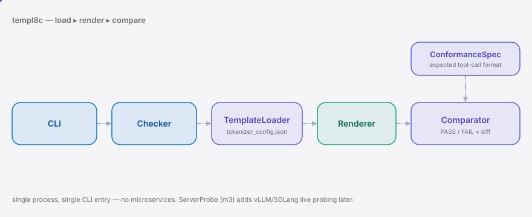
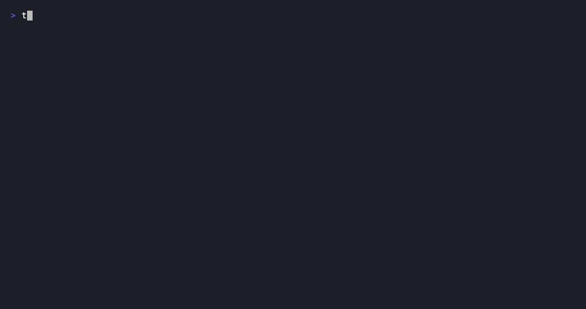

<div align="right"><sub><b>English</b>&nbsp;&nbsp;⇄&nbsp;&nbsp;<a href="./README.md">简体中文</a></sub></div>

<picture>
  <source media="(prefers-color-scheme: dark)" srcset="./assets/hero-dark.svg">
  <source media="(prefers-color-scheme: light)" srcset="./assets/hero-light.svg">
  
</picture>

<p align="center"><sub>The conformance checker that catches chat-template tool-call mismatches before CN model deployment.</sub></p>

<p align="center">
  <a href="./LICENSE"></a>
  <a href="https://github.com/SuperMarioYL/templ8c/releases"></a>
  <a href="https://github.com/SuperMarioYL/templ8c/actions/workflows/ci.yml"></a>
  
</p>

> One command before deployment verifies the tool-call format of a chat template — PASS/FAIL + structured diff that pinpoints where the template diverges from the reference spec.

<h2> Architecture</h2>

<picture>
  <source media="(prefers-color-scheme: dark)" srcset="./assets/atlas-dark.svg">
  <source media="(prefers-color-scheme: light)" srcset="./assets/atlas-light.svg">
  
</picture>

Single process, single CLI entry point. `Checker` loads the Jinja2 chat template (from `tokenizer_config.json` or a bundled reference), renders it with canonical test messages, then `Comparator` diffs the output against a `ConformanceSpec` field by field and emits a `TemplateDiff` list. Without `--server` it checks the template's own rendering; the ServerProbe (m3) later wires in live vLLM/SGLang probing.

The core primitive is **ConformanceSpec** — a declarative data structure that defines "what tool-call format a given model's chat template should produce", turning the implicit knowledge scattered across docs and GitHub issues into an explicit, executable spec.

<h2> Why this exists</h2>

CN model releases (GLM-5.3-Flash, Qwen3.8-Flash-Next, DeepSeek-V4) have compressed from a quarterly to a weekly/biweekly cadence, and each release may update the chat template. Inference servers (vLLM, SGLang, llama.cpp) load the template as a config file and never validate whether it is "correct" — because "correct" needs a reference to compare against, and the server is itself the thing being checked: it cannot be both referee and player. The result is silent tool-calling failure: the tool-call JSON the model emits does not match the format the server expects, the agent pipeline breaks, and no pre-deployment checker catches it. templ8c closes that gap — confirm the template adaptation is right within minutes of a release, instead of debugging by hand after the agent crashes.

<h2> Quickstart</h2>

```bash
pip install templ8c
templ8c check --model glm-5.3-flash
# PASS/FAIL + structured diff showing where the template diverges from the reference spec
```

<details><summary>sample output</summary>

```
templ8c v0.1.0 — chat template conformance checker
Model: glm-5.3
Template source: bundled reference (tokenizer_config.json)

  Field              Expected        Actual       Status
  system_marker      role token      found        PASS
  user_marker        role token      found        PASS
  tool_call_wrapper  [CALL_TOOL]     found        PASS
  tool_call_schema   get_weather     all present  PASS
  assistant_marker   role token      found        PASS
  tool_call_wrapper  [CALL_TOOL]     found        PASS
  tool_call_schema   get_weather     all present  PASS
  tool_marker        role token      found        PASS

PASS: all fields conform to the reference spec.
```
</details>

<h2> Usage</h2>

```bash
# Render a single message through a model's chat template
templ8c render --model glm-5.3-flash --message "What's the weather in SF?"

# Conformance check (m1 checks the template rendering itself)
templ8c check --model qwen3.8

# List supported model families
templ8c models
```

Programmatic API in [`examples/render_example.py`](./examples/render_example.py):

```python
from templ8c.checker import Checker

checker = Checker()
print(checker.render("glm-5.3-flash", "What's the weather in SF?"))
result = checker.check("glm-5.3-flash")
print(result.passed, result.failed_count)
```

<h2> Demo</h2>



<h2> Roadmap</h2>

- [x] **m1** — load and render chat templates (GLM-5.3 / Qwen3.8 / DeepSeek-V4) + ConformanceSpec / comparator, PASS/FAIL + structured diff
- [ ] **m2** — per-model spec files + rich colored diff output
- [ ] **m3** — ServerProbe: live-probe the server-rendered template via vLLM / SGLang API
- [ ] future — CI/CD integration (GitHub Action step), more CN models and inference servers

<h2> License</h2>

MIT — see [`LICENSE`](./LICENSE). Issues and PRs welcome.

<p align="center"><sub><a href="./LICENSE">MIT</a> © 2026 SuperMarioYL</sub></p>
