[English](./README.en.md) · [Website](https://templ8c.lei6393.com) · [GitHub](https://github.com/SuperMarioYL/templ8c)

<picture>
  <source media="(max-width: 600px) and (prefers-color-scheme: dark)" srcset="./assets/presentation/hero-mobile-dark.svg">
  <source media="(max-width: 600px)" srcset="./assets/presentation/hero-mobile-light.svg">
  <source media="(prefers-color-scheme: dark)" srcset="./assets/presentation/hero-dark.svg">
  
</picture>

# templ8c

**服务启动前，检查对话模板结构**

templ8c 将标准消息序列交给 Jinja 对话模板渲染，再检查预期角色标记、工具包装符和字段名。内置模板用于演示检查器自身的约定；`--tokenizer-config` / `--source` 可检查真实模型产物，`--server` 可探测 vLLM / SGLang 实际渲染的模板。

## 为什么需要它

模板改动可能在应用代码未变时改变工具调用周围的文本。把消息样本与预期标记放在一起，可通过可重复本地检查发现结构差异。

- **覆盖多种角色** — 标准样本包括 system、user、工具调用与多轮输出。
- **指出缺失字段** — 每项差异包含字段、预期标记、观察文本和 PASS/FAIL。
- **读取本地配置** — TemplateLoader 从 tokenizer_config.json 提取 chat_template，供 check_source 检查。
- **检查真实模板** — `templ8c check --tokenizer-config <path>` 或 `--source hf:<repo>|modelscope:<model>` 直接检查实际模型产物。
- **探测推理服务** — `templ8c check --server vllm|sglang` 通过服务器自身的 chat template 渲染测试消息并对比规范。

## 架构

<picture>
  <source media="(max-width: 600px) and (prefers-color-scheme: dark)" srcset="./assets/presentation/architecture-mobile-dark.svg">
  <source media="(max-width: 600px)" srcset="./assets/presentation/architecture-mobile-light.svg">
  <source media="(prefers-color-scheme: dark)" srcset="./assets/presentation/architecture-dark.svg">
  
</picture>

ConformanceSpec 定义角色标记、工具调用要求和标准样本。TemplateLoader 读取内置模板或所选来源，Renderer 提供沙箱化的 Jinja 环境，Comparator 检查标记、包装符和名称是否出现，Checker 汇总字段级结果，ServerProbe 经推理服务的 `/tokenize` + `/detokenize` 端点捕获服务器实际渲染的 prompt。

| 组件 | 职责 |
| --- | --- |
| `ConformanceSpec` | markers and message cases |
| `TemplateLoader` | Jinja source |
| `Renderer` | canonical message outputs (sandboxed) |
| `Comparator` | field-level PASS / FAIL |
| `ServerProbe` | server-rendered prompts (vLLM / SGLang) |

## 安装与快速上手

需要 Python 3.12+ 和 uv。模板检查不需要模型权重或推理服务。

```bash
git clone https://github.com/SuperMarioYL/templ8c.git
cd templ8c
uv venv --python 3.12
source .venv/bin/activate
uv pip install -e .
```

示例基于内置 qwen3.8 模板创建本地 tokenizer_config.json，经实际加载器读取，再移除预期包装符重新检查。不下载上游模板。

```bash
.venv/bin/python examples/presentation_demo.py
```

## 实际运行示例

<picture>
  <source media="(max-width: 600px) and (prefers-color-scheme: dark)" srcset="./assets/presentation/process-mobile-dark.svg">
  <source media="(max-width: 600px)" srcset="./assets/presentation/process-mobile-light.svg">
  <source media="(prefers-color-scheme: dark)" srcset="./assets/presentation/process-dark.svg">
  
</picture>

Ten checks pass for the bundled example; removing its wrapper creates two failing fields.

```text
{"input": "bundled example", "passed": true, "checks": 10, "failed_fields": []}
{"input": "wrapper removed", "passed": false, "checks": 10, "failed_fields": ["tool_call_wrapper", "tool_call_wrapper"]}
Scope: repository-authored reference templates; no upstream model release or inference server tested.
```

完整命令与输出保存在 [docs/demo-results.json](./docs/demo-results.json). 输入和复现代码均随仓提供。


保留已有录制供参考；上方文字示例给出当前可复现的操作。

## 用法

CLI 模型 ID 选择仓库定义的系列及别名。不带来源参数时，check 比较内置参考模板与配套规范；`--tokenizer-config` 指向本地 tokenizer_config.json，`--source hf:<repo>` / `--source modelscope:<model>` 拉取远端模板（二者互斥）。读取 result.diffs 与 result.failed_count；只有具备权威依据时才修改预期约定。

```bash
.venv/bin/templ8c models
.venv/bin/templ8c render --model qwen3.8 --message "请查询天气。"
.venv/bin/templ8c check --model qwen3.8
.venv/bin/templ8c check --model qwen3.8 --tokenizer-config tokenizer_config.json
.venv/bin/templ8c check --model qwen3.8 --source hf:zai-org/Qwen3.8
.venv/bin/templ8c check --model qwen3.8 --server vllm --server-url http://localhost:8000
.venv/bin/templ8c --version
```

Python 本地产物用法为 source = TemplateLoader().load_from_tokenizer_config("tokenizer_config.json")，然后调用 Checker().check_source("qwen3.8", source)。

## 配置

规范位于 src/templ8c/reference/specs.py。输入接受 chat_template 字符串或命名条目列表，列表形式取第一个模板。远程辅助方法获取仓库默认版本，不固定不可变修订；需要可复现时可先下载指定版本到本地。`--server vllm|sglang` 将标准测试消息经服务器的 `/tokenize`（messages 形式，应用服务器 chat template）与 `/detokenize` 端点渲染为 prompt，再与同一规范比较；默认地址 `http://localhost:8000`，可用 `--server-url` 覆盖。模板加载失败、拉取失败或探测失败都以非零退出码报错。

## 集成与职责分工

<picture>
  <source media="(max-width: 600px) and (prefers-color-scheme: dark)" srcset="./assets/presentation/integrations-mobile-dark.svg">
  <source media="(max-width: 600px)" srcset="./assets/presentation/integrations-mobile-light.svg">
  <source media="(prefers-color-scheme: dark)" srcset="./assets/presentation/integrations-dark.svg">
  
</picture>

默认 check 将仓库编写的参考模板与配套规范比较；检查真实模型产物时，用 `--tokenizer-config` 或 `--source` 指向其实际 tokenizer_config.json。内置检查成功不代表验证了上游模型版本。

| 路径 | 已实现职责 |
| --- | --- |
| Jinja source | render canonical messages |
| tokenizer_config.json | local template extraction（CLI `--tokenizer-config`） |
| HF / ModelScope | remote fetch（CLI `--source`） |
| vLLM / SGLang server | template probe（CLI `--server`） |
| Python API | check_source for custom templates |
| CLI | render / check / models |

## 限制与后续方向

- 比较器主要检查子串是否出现，不解析全部工具 JSON 语义，也不证明模板等价。
- 内置规范与系列名称是仓库样本，不是已经验证的上游约定。
- 服务器探测走各平台公开的 `/tokenize` + `/detokenize` 端点，检查的是服务器渲染的模板文本，不能说明在线工具调用质量。

已实现本地渲染（沙箱化）、参考约定、来源加载器、字段级比较和推理服务探测。后续方向包括验证上游参考与更深入的结构比较。

## 许可与贡献

许可见 [LICENSE](./LICENSE). 反馈问题时请提供最小输入、执行命令和实际输出。
